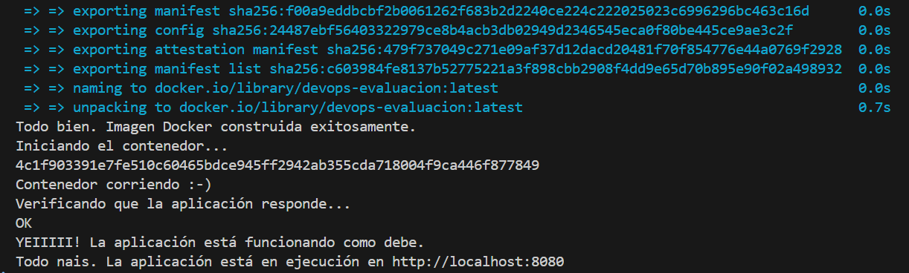

# ArquitecturaSFV-P1

# Evaluación Práctica - Ingeniería de Software V

## Información del Estudiante

- **Nombre:** Yuluka Gigante Muriel
- **Código:** A00369316
- **Fecha:** 07/03/2025

## Resumen de la Solución

Esta solución implementa la contenerización de una aplicación Node.js mediante Docker, junto con un script de automatización en Bash para:

- Verificar que Docker está instalado y en funcionamiento.
- Verificar la existencia del archivo `.env`, y la variable necesaria `PORT`.
- Construir y verificar la imagen.
- Ejecutar y verificar el contenedor.
- Validar que el servicio esté funcionando correctamente, probando su respuesta.

## Dockerfile

El Dockerfile está diseñado para ser ligero y eficiente:

1. Usa una imagen base node:18-alpine para reducir el tamaño del contenedor.
2. Define el directorio de trabajo como `/app`.
3. Copia los archivos de dependencias y las instala en modo producción.
4. Copia el archivo de variables de entorno `.env` para que esté disponible en el contenedor.
5. Copia el resto de la aplicación y expone el puerto 8080.
6. Utiliza CMD para ejecutar el servicio con Node.js.

## Script de Automatización

El script de automatización está diseñado para:

- Verificar que Docker está instalado y en funcionamiento.
- Verificar la existencia del archivo `.env`, y la variable necesaria `PORT`.
- Construir y verificar la imagen.
- Ejecutar y verificar el contenedor.
- Validar que el servicio esté funcionando correctamente, probando su respuesta.
- Transversalmente, muestra mensajes informativos al usuario acerca del estado de la ejecución.

## Principios DevOps Aplicados

1. **Infraestructura como Código (IaC):** La infraestructura se define en archivos de código como el Dockerfile y el script Bash.

2. **Automatización:** La construcción y despliegue se realizan automáticamente con el script.

3. **Monitorización:** Se incluye una prueba automática para validar que el servicio está en funcionamiento y se informa en todo momento.

## Captura de Pantalla

Capturas:


_Inicio de la consola al ejecutar el script de automatización (`deploy.sh`)_


_Final de la consola al ejecutar el script de automatización (`deploy.sh`)_


_Contenedor corriendo bien_


_Dentro del contenedor creado_

## Mejoras Futuras

1. Agregar un Docker Compose para facilitar la gestión de entornos.
2. Implementar CI/CD con GitHub Actions para construir y probar la imagen automáticamente.
3. Extender el script para soportar PowerShell en Windows.

## Instrucciones para Ejecutar

Para ejecutar, se debe:

- Clonar el repositorio

    ```bash
    git clone https://github.com/yuluka/ingesoftV-parcial1.git
    ```

    > **Nota:** Si estás en Windows, es mejor hacerlo todo con la Git Bash.

- Ejecutar script de automatización

    Pararse en el directorio raíz del proyecto y ejecutar:

    ```bash
    ./deploy.sh
    ```

- Verificar

    Verificar que la aplicación esté corriendo en `http://localhost:8080`.